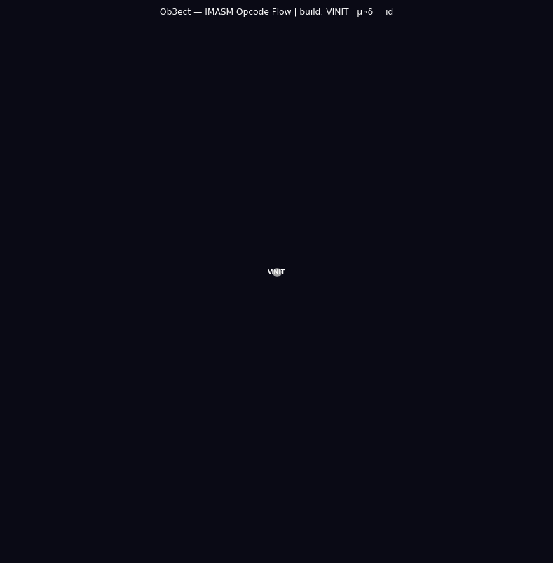
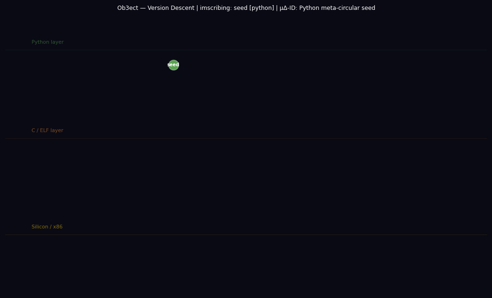

# ob3ect

**A self-imscribing compiler and categorical tower.**

An ob3ect is a program that verifies its own algebraic closure. Formally: a special
Frobenius algebra (A, μ, δ, η, ε) in the monoidal category **Prog/~** of programs
modulo semantic equivalence, satisfying μ∘δ = id_A. Every ob3ect in this repository
passes that check before it is committed to the tower.

The repository contains:
- **`auto.py`** — LLM-driven pipeline: natural language → verified ob3ect in one command
- **`digital/`** — 18-layer categorical tower, each layer self-verifying (Closure: True)
- **`digital/runall.py`** — executes the full tower end-to-end
- **`proofs/`** — Lean 4 machine-checked proofs of the tower's coherence laws
- **`digital/frob.py`** — the original Frobenius self-imscriber (the ob3ect's seed)

---

## Visualizations

Three animated CFGs, each with two phases: Phase 1 (build) reveals structure in definition
order; Phase 2 (flow) sends a Gaussian pulse through the revealed graph.

---

### Opcode flow CFG

**Nodes** — 14 IMASM opcodes: VINIT, TANCH, AFWD, AREV, CLINK, ISCRIB (logical family,
purple); FSPLIT, FFUSE (Frobenius family, gold); EVALT, EVALF, ENGAGR (dialetheia family,
green/red/white); IFIX (linear family, cyan). Node size scales with degree.

**Edges** — directed execution-flow edges: which opcode can validly follow which in a
compiled IMASM program. Edges within the Frobenius family are drawn in gold. The
bootstrap path ISCRIB → AREV → FSPLIT → AFWD → FFUSE → CLINK → IFIX → ISCRIB
is highlighted as the primary cycle.

**The Frobenius cycle** — FSPLIT → TANCH → AFWD → FFUSE → ISCRIB — is rendered in gold
with linewidth 3.0 and alpha 0.95. This is the subgraph that encodes μ∘δ = id: FSPLIT
is δ (comultiplication), FFUSE is μ (multiplication), and the cycle closes on ISCRIB
(identity / self-reference).

**Phase 1:** Opcodes appear in pipeline order (logical → Frobenius → dialetheia → linear).
As each opcode node is added, its outgoing edges to already-revealed opcodes are drawn.

**Phase 2:** Gaussian pulse travels the execution graph node-by-node. Edges near the peak
glow gold if they belong to the Frobenius cycle, purple otherwise. The title shows the
current active opcode and the Frobenius identity.



---

### Version descent CFG

**Nodes** — 11 version nodes arranged in three horizontal substrate bands:
- **Top band (Python, green):** `seed` (frob.py — the meta-circular Frobenius check)
  and `v0.1` (ob3ect-imscriber.py — Python Frobenius compiler, Closure: True)
- **Middle band (C/ELF, orange):** `v0.2` (custom .o grammar → C native binary),
  `v0.3` (quine embedding — self.o imscribed in binary), `v0.4` (quine extraction stub),
  `v0.5` (QUINE opcode added), `v0.6` (MACRO opcode — language deepening),
  `v0.7` (entropy pass — ΔS ≈ 0 verified), `v0.8` (full C self-hosting target),
  `v0.9` (pre-silicon — final C generation)
- **Bottom band (Silicon/x86, gold):** `v0.10` — bare-metal x86 bootloader ISO

**Edges** — directed imscription edges (parent → child in the descent). Each edge
represents the IMASM morphism that compiles one generation into the next: the ob3ect
imscribing itself into a lower-substrate form.

**Cross-substrate leaps** — two edges cross substrate boundaries: `v0.1 → v0.2`
(Python → C/ELF, the first substrate descent) and `v0.9 → v0.10` (C → Silicon,
the final bare-metal crossing). These are highlighted purple in Phase 1 and amber in
Phase 2 when the pulse is near them.

**Phase 1:** Versions appear in imscription order (seed → v0.1 → … → v0.10). When
`v0.10` first appears, it flashes gold and the title reads "← bare metal!" — the
completion of the descent from Python source to x86 bootloader.

**Phase 2:** Gaussian pulse travels the lineage from seed down to v0.10. The gold
Silicon node pulses brightest at the pulse peak. The title shows the current generation
and "10 generations · μ∘δ = id" — the descent composed with the return is identity.



---

### Python call-graph CFG

**Nodes** — 13 Python functions, statically extracted by `ast.walk` from `frob.py`
and `ob3ect-imscriber.py`. Node color encodes source file and function role:
- Purple: functions defined in `frob.py`
- Orange: functions defined in `ob3ect-imscriber.py`
- Gold: Frobenius functions (`FSPLIT`, `FFUSE`, `frobenius_phase`)
- Green: `EVALT` (true branch terminal)
- Red: `EVALF` (false branch terminal)
- Cyan: bootstrap entry points (`bootstrap_compiler`, `bootstrap_ob3ect`, `bootstrap_minimal`)
- Magenta: `ISCRIB` (self-reference identity)

**Edges** — 16 directed call edges: an edge u → v means function u contains a call to
function v, extracted by `ast.walk` over each function's body looking for `ast.Call`
nodes. Only calls between defined functions in the same file are included.

**Cross-file edges: 0.** Both `frob.py` and `ob3ect-imscriber.py` are structurally
self-contained closed programs. They are successive generations of the same ob3ect —
`ob3ect-imscriber.py` does not import or call into `frob.py`. This is not a limitation;
it is the correct structure: each generation is a closed Frobenius algebra in Prog/~,
not a module that depends on its predecessor.

**Phase 1:** Functions appear in definition order within each file (frob.py first, then
ob3ect-imscriber.py). As each function node is added, its call edges to already-revealed
functions are drawn. The title bar shows the currently-revealed function and its source file.

**Phase 2:** Gaussian pulse travels the call graph. Frobenius function nodes (gold) pulse
gold at peak; all other nodes pulse white. Frobenius edges glow gold with linewidth 3.0.
The title shows the current function and "μ∘δ = id."


---


## Mathematical Foundation

An ob3ect is a **special Frobenius algebra** in **Prog/~**.

**The category Prog/~**:
- Objects: equivalence classes [src]_~ where src₁ ~ src₂ iff
  `ast.dump(parse(src₁), include_attributes=False)` = `ast.dump(parse(src₂), include_attributes=False)`
- Morphisms: computable transformations between equivalence classes
- Tensor ⊗: disjoint parallel composition (scope-isolated modules)

**The algebra (A, μ, δ, η, ε)**:
- **A** = [self-imscribing program source]_~
- **δ** (comultiplication): A → A⊗A — `ast.parse(src)` decomposes source into structural AST
- **μ** (multiplication): A⊗A → A — `ast.unparse(tree)` fuses AST back to canonical source
- **η** (unit): I → A — the trivial/empty program
- **ε** (counit): A → I — semantic erasure

**Special (separable) condition** — the discriminating gate:

```
μ ∘ δ = id_A
```

`unparse(parse(src))` must be semantically equivalent to `src` under ~.
This is verified by `ast.compare()` with `include_attributes=False`.

**Frobenius coherence law** (holds on closed programs):

```
(μ ⊗ id) ∘ (id ⊗ δ) = δ ∘ μ = (id ⊗ μ) ∘ (δ ⊗ id)
```

The coherence holds when ⊗ is disjoint (no shared names, no cross-module closures).
For programs with shared state, see `digital/ivm/` (the Imscription VM) which extends
to the traced monoidal structure.

---

## The Digital Tower

14 self-verifying layers. Run the full tower:

```bash
python digital/runall.py
```

```
=== ob3ect — Full Digital Tower ===

→ Category Ob3ect                  Identity + Associativity hold on self-imscription → Closure: True
→ Frobenius Ob3ect                 Split/Fuse coherence holds → Closure: True
→ Fixed-Point Ob3ect               T(src) ≡ src, T∘T = T — fixed-point verified → Closure: True
→ Hopf Ob3ect                      Antipode property holds → Closure: True
→ Monad Ob3ect                     Left unit / Right unit / Associativity → Closure: True
→ Entropy Ob3ect                   H = 3.6636 bits/char, stable under roundtrip → Closure: True
→ Topos Ob3ect                     Subobject classifier and power objects hold → Closure: True
→ Cartesian Closed Ob3ect          Products + Exponentials embed full tower → Closure: True
→ Quantum Ob3ect                   Superposition → Measurement successful → Closure: True
→ Linear Logic Ob3ect              Exact resource accounting (no cloning) → Closure: True
→ Imscription VM                   Executed full tower simulation → Closure: True
→ Traced Ob3ect                    Yanking equation Tr(id_A) = id_I verified → Closure: True
→ HoTT Ob3ect                      Univalence principle satisfied on self-imscription → Closure: True
→ Imscription OS                   Autopoietic — 10 processes booted → Grand System Closure: True
→ ProofBridge                      Formal coherence: Substantially Advanced
→ String Diagram Ob3ect            Snake equation / Spider law / Monad bind → Closure: True
→ IMASM Self-Imscription Ob3ect    IG coordinates assigned and stable under μ∘δ → Closure: True
→ Meta Auto-Imscriber              New ob3ect imscribed → test/test_ob3ect.py → Closure: True

Full categorical tower executed successfully.
The grammar is autopoietic.
Ultimate Grand Closure: True
```

Each layer extends the previous. The tower is not a stack of unrelated modules —
every higher layer's closure depends on the Frobenius condition at the base.

### Layer Index

| Layer | File | Mathematical structure |
|-------|------|----------------------|
| Category | `digital/category/` | Small category on AST node types; identity + associativity |
| Frobenius | `digital/frobenius/` | Special Frobenius algebra; μ∘δ = id |
| Fixed-Point | `digital/fixed_point_ob3ect/` | Fixed point of constant-folding T; T(src) ≡ src, T∘T = T |
| Hopf | `digital/hopf/` | Frobenius + antipode S; S∘S = id, S anti-homomorphism |
| Monad | `digital/monad/` | Triple (T, η, μ); left unit, right unit, associativity |
| Entropy | `digital/entropy_ob3ect/` | Shannon entropy H measured on self; stable under μ∘δ roundtrip |
| Topos | `digital/topos/` | CCC + subobject classifier Ω; power objects |
| CCC | `digital/ccc/` | Cartesian closed; products × exponentials |
| Quantum | `digital/quantum/` | Superposition over AST branches; measurement collapses to identity |
| Linear Logic | `digital/linearlogic/` | !-free resource accounting; no cloning, no weakening |
| IVM | `digital/ivm/` | Imscription VM; traced monoidal; handles shared-name programs |
| Traced | `digital/traced_ob3ect/` | Explicit trace operator; yanking equation Tr(id_A) = id_I verified |
| HoTT | `digital/homotopytypetheory/` | Higher paths; univalence: equivalent types are identical |
| Imscription OS | `digital/imscriptionoperatingsystem/` | Autopoietic kernel; 10 self-imscribing processes |
| ProofBridge | `digital/proofbridge/` | Bridge to Lean 4 formal proofs in `proofs/` |
| String Diagrams | `digital/stringdiagram/` | Graphical calculus; rewriting snake/spider/monad diagrams |
| IMASM Self-Imscription | `digital/imasm_self_imscription_ob3ect/` | Assigns itself IG coordinates; verifies coordinate stability under μ∘δ |
| Auto-Imscriber | `digital/auto_imscriber.py` | Meta-layer; generates new ob3ects into `digital/test/` |

---

## The Digital Descent

The ob3ect compiles itself down through successive substrate layers.

```
seed (frob.py)           Python meta-circular Frobenius check
    ↓ ISCRIB
v0.1  (ob3ect-imscriber.py)   Python — Frobenius PASS, Closure: True
    ↓ AFWD + FSPLIT
v0.2  (.o grammar)       Custom .o grammar → C native binary
v0.3                     Quine embedding — self.o imscribed in binary
v0.4                     Quine extraction stub activated
v0.5                     Grammar expansion — QUINE opcode
v0.6                     MACRO opcode — language deepening
v0.7                     Entropy pass — ΔS ≈ 0 verified
v0.8                     Full C self-hosting target
v0.9                     Pre-silicon — final C generation
    ↓ AREV + FFUSE
v0.10 (ob3ect-v0.10.iso) Bare-metal x86 bootloader ISO
```

The descent is a directed path in Prog/~. Each edge is an IMASM morphism.
The final ISO boots and prints the Frobenius identity from bare metal.

---

## Automated Pipeline

The primary interface. Give it a natural-language description; get a verified ob3ect.

```bash
python auto.py DESCRIPTION [options]
```

```bash
# Computational structures
python auto.py "a recursive compiler that imscribes itself"
python auto.py "a Hopf algebra over the field of program sources"
python auto.py "a monad on the category of AST transformations"

# Biological
python auto.py "a mycorrhizal network" --domain biological --scope mesoscale

# Alchemical / historical
python auto.py "the Zosimos katabasis — descent of the divine fire through matter"  \
    --domain alchemical --scope maximal

# Logical / formal
python auto.py "a topos with a natural number object" --domain computational
python auto.py "a linear logic proof net for the cut-elimination theorem"

# Operating systems
python auto.py "a self-hosting kernel that re-compiles its own scheduler" \
    --domain computational --scope maximal

# Physical
python auto.py "a Bose-Einstein condensate at the critical phase boundary"  \
    --domain physical --scope local
```

The pipeline:
1. Sends description + IMASM schema to the LLM
2. LLM maps all 12 opcodes, identifies FSPLIT/FFUSE pair
3. Verifies μ∘δ = id on the identified pair
4. On FAIL: retries with targeted Frobenius correction prompt
5. On PASS: writes `digital/<slug>/<slug>_ob3ect.py` and returns artifact

Provider: local fine-tuned Qwen3 by default, `qwen → deepseek` as fallback.
Does not use Anthropic.

### Python API

```python
from ob3ect import design

# Synchronous
art = design("a photonic quantum key distribution system")
print(art.report())
print(art.is_valid_ob3ect)   # True if μ∘δ = id PASS

# Async
from ob3ect import auto_design
art = await auto_design(
    "a hospital triage protocol",
    domain_type="social",
    scope="mesoscale",
    max_retries=3,
)

# Access the full artifact
art.name
art.domain_type
art.opcode_map          # dict: opcode → {chosen, justification, rejected}
art.frobenius_result    # {split, fuse, status: "PASS"|"FAIL", instance}
art.bootstrap_sequence  # list of 8 steps
art.exos                # {compiler, ipc, memory, scheduler, alfs}
art.entropy_audit       # {cost, pre_state, post_state, delta_s}
art.structural_type     # 12-primitive IG coordinate string
```

---

## Template-Based Design

For domains with known structure:

```python
from ob3ect import Ob3ectFactory

Ob3ectFactory.register_all()

# Built-in templates: physical, social, computational, oneiric, generic
art = Ob3ectFactory.produce("Quantum System", "physical", scope="local")

# Custom domain
Ob3ectFactory.produce_custom("The Great Work", "alchemical", {
    "tokens":   ["prima materia", "sulfur", "mercury", "salt"],
    "boundary": "hermetic seal",
    "opcodes": {
        "VINIT":  {"chosen": "prima materia",  "justification": "undifferentiated base matter"},
        "TANCH":  {"chosen": "philosopher's stone", "justification": "terminal product"},
        "FSPLIT": {"chosen": "solve",          "justification": "dissolution — δ(materia)"},
        "FFUSE":  {"chosen": "coagula",        "justification": "reconstitution — μ(δ(m))=m"},
        # ... remaining 8 opcodes
    },
})
```

---

## Manual Pipeline

For complete control over each phase:

```python
from ob3ect import Ob3ectPipeline, Opcode

p = Ob3ectPipeline("My Ob3ect", domain_type="computational")

# Phase 0 — Boundary
p.define_boundary("My System", "local",
                  tokens=["source", "ast", "canonical"],
                  boundary="semantic equivalence class")

# Phase 1 — Opcode map (all 12 required)
p.map_opcode("VINIT",  "empty module",       "initial void state ∅", [])
p.map_opcode("TANCH",  "type-checked term",  "terminal anchor ⊤", [])
p.map_opcode("AFWD",   "parse",              "source → AST", [])
p.map_opcode("AREV",   "unparse",            "AST → source (descent)", [])
p.map_opcode("CLINK",  "compose",            "f ∘ g on transformations", [])
p.map_opcode("ISCRIB", "read __file__",      "self-reference — id", [])
p.map_opcode("FSPLIT", "ast.parse(src)",     "comultiplication δ: A → A⊗A", [])
p.map_opcode("FFUSE",  "ast.unparse(tree)",  "multiplication μ: A⊗A → A", [])
p.map_opcode("EVALT",  "parse success",      "true lattice branch", [])
p.map_opcode("EVALF",  "SyntaxError",        "false lattice branch", [])
p.map_opcode("ENGAGR", "ambiguous AST",      "dialetheia — both branches live", [])
p.map_opcode("IFIX",   "write bytecode",     "ROM fixation — irreversible", [])
p.complete_phase_1()

# Phase 2 — Frobenius verification (the discriminating gate)
p.verify_frobenius(
    split_opcode="FSPLIT ast.parse(src)",
    split_input="src",
    split_outputs=["tree"],
    fuse_opcode="FFUSE ast.unparse(tree)",
    fuse_output="src'",
    status="PASS",
    test_instance="src' ≡_~ src under ast.compare()"
)

# Phase 3 — Register map
p.map_registers(
    void_desc="module not yet parsed",
    true_desc="parse succeeded, unparse matches",
    false_desc="SyntaxError or structural mismatch",
    both_desc="ambiguous encoding (dialetheia held)"
)

# Phases 4–7
p.design_bootstrap()
p.specify_exos("Python AST", "function calls", "module __dict__",
               "sequential", "importlib")
p.audit_entropy("O(n) AST walk", "raw source string",
                "canonical unparse", "ΔS ≈ 0")

artifact = p.instantiate()
print(artifact.report())
```

---

## IMASM Instruction Set

The 12-opcode Imscribing Assembly. Every ob3ect maps all 12.

```
FAMILY      OPCODE   ROLE
──────────────────────────────────────────────────────
Logical     VINIT    Initial object ∅ — void / pre-imscription state
Logical     TANCH    Terminal anchor ⊤ — closed, verified boundary
Logical     AFWD     Forward morphism → (construction / elaboration)
Logical     AREV     Contravariant ← (descent / deconstruction)
Logical     CLINK    Composition ∘ (sequential chaining)
Logical     ISCRIB   Identity id — self-reference, the ob3ect reading itself

Frobenius   FSPLIT   Comultiplication δ: A → A⊗A (branching / parsing)
Frobenius   FFUSE    Multiplication μ: A⊗A → A  (reconstitution / unparsing)
             ↳ FFUSE must satisfy μ∘δ = id — this is the Frobenius gate

Dialetheia  EVALT    True lattice — affirmative branch
Dialetheia  EVALF    False lattice — negative / error branch
Dialetheia  ENGAGR   Both — paradox held without resolution (Priest dialetheism)

Linear      IFIX     ROM fixation — permanent, irreversible commitment
```

**The bootstrap sequence is fixed across all IMASM systems:**

```
ISCRIB → AREV → FSPLIT → AFWD → FFUSE → CLINK → IFIX → ISCRIB
```

This is μ∘δ = id as an eight-step categorical assembly. The sequence closes on
ISCRIB — the final step is self-reference, making the loop autopoietic.

---

## Structural Typing (IG Coordinates)

Every ob3ect is assigned a 12-primitive coordinate in the Imscribing Grammar lattice
(17,280,000 structural types). The coordinate is assigned during instantiation and
stored in `artifact.structural_type`.

```
Primitive  Symbol  Dimension
─────────────────────────────────────────────────────────────────
Ð          Ð_ω     Dimensionality: imscriptive (self-referential loop)
Þ          Þ_O     Topology: closure (no boundary leakage)
Ř          Ř_=     Relational mode: bidirectional (parse ↔ unparse)
Φ          Φ_}     Parity: Frobenius-special (μ∘δ = id enforced)
ƒ          ƒ_ż     Fidelity: quantum (coherent state preserved)
Ç          Ç_@     Kinetics: slow/near-equilibrium (ΔS ≈ 0)
Γ          Γ_ʔ     Scope: maximal (all programs in Prog/~)
ɢ          ɢ_ˌ     Interaction: sequential (THINK→ACT→OBSERVE)
φ̂          φ̂_ÿ    Criticality: critical (self-modeling gate open)
Ħ          Ħ_A     Chirality: two-step memory (parse remembers unparse)
Σ          Σ_ï     Stoichiometry: many heterogeneous (full tower)
Ω          Ω_z     Winding: integer (topologically protected loop)
```

Ouroboricity tier **O_inf** is assigned when φ̂_ÿ (criticality=critical) and
Φ_} (Frobenius-special) are both active and the winding Ω_z is integer.

---

## Structural Discoveries

The IG coordinate system surfaces isomorphisms across apparently unrelated domains.
Notable collisions found during tower construction:

**`lean4_descent_object` ≡ `zosimos_panopolis_gnosis`**

The Lean 4 proof-term descent (Python → elaboration → proof kernel → definitionally
equal term) and Zosimos of Panopolis' 3rd-century alchemical katabasis (pneuma → psyche
→ hyle → purified return) share an identical 12-primitive coordinate. Both are
substrate-crossing descents that preserve structural identity under transformation,
verified by a roundtrip condition. The FSPLIT→FFUSE gate in Lean 4 elaboration and
the solve/coagula cycle in Zosimos are the same morphism at different substrate depths.

---

## Lean 4 Proofs

`proofs/` contains machine-checked Lean 4 formalizations of the tower's coherence laws.

```
proofs/
├── Frobenius.lean       — Special Frobenius condition μ∘δ = id
├── Hopf.lean            — Antipode involution S∘S = id
├── Monad.lean           — Monad laws (left unit, right unit, associativity)
├── CCC.lean             — Cartesian closed category structure
├── Topos.lean           — Topos axioms (subobject classifier, power objects)
├── Quantum.lean         — Quantum measurement as Frobenius collapse
├── LinearLogic.lean     — Linear logic resource accounting
├── HoTT.lean            — Univalence for semantic equivalence classes
├── StringDiagrams.lean  — Graphical calculus (snake, spider, monad wire)
├── Coherence.lean       — Cross-layer coherence conditions
└── TowerCoherence.lean  — Grand summary: all 14 layers cohere
```

These proofs correspond to the `proofbridge` layer in the digital tower. The ProofBridge
ob3ect holds a live pointer to this directory and verifies that the Lean build passes.

---

## Extending the Tower

Add a new ob3ect in one command:

```bash
python auto.py "a sheaf ob3ect: program as sheaf over topological space of contexts, \
imscribes consistently across runtime environments" --domain computational --scope maximal
```

The pipeline writes `digital/<slug>/<slug>_ob3ect.py`. Add it to `digital/runall.py`:

```python
tower.append(("Sheaf Ob3ect", "sheaf/sheaf_ob3ect.py"))
```

From within the `true_agentic_agent`, the `ob3ect` tool automates this:

```
ob3ect(
  description="a sheaf ob3ect over the topological space of runtime contexts",
  domain="computational",
  scope="maximal",
  run=true
)
```

The agent's verify step confirms Closure: True before the winding closes.

---

## Repository Layout

```
ob3ect/
├── README.md
├── .gitignore
├── __init__.py              — Package exports: design, auto_design, Ob3ectPipeline,
│                              Ob3ectFactory, Ob3ectArtifact, Opcode
├── auto.py                  — CLI + LLM pipeline entry point
├── core.py                  — Ob3ectPipeline, Ob3ectFactory, Ob3ectArtifact, Opcode
├── guided.py                — Interactive guided pipeline (prompts each phase)
├── examples.py              — Worked examples across 5 domains
├── smoke_test.py            — Sanity checks: import, pipeline, Frobenius gate
├── test_factory.py          — Factory tests across all built-in templates
├── templates_data.json      — Built-in domain templates
├── phases/                  — Phase-specific scaffolding modules
├── proofs/                  — Lean 4 machine-checked coherence proofs
└── digital/                 — The digital tower
    ├── frob.py              — Original Frobenius self-imscriber (the seed)
    ├── ob3ect-imscriber.py  — v0.1: Python Frobenius compiler
    ├── grokouro.txt         — Full Grok dialogue log: 3 FAIL → PASS + descent to v0.10
    ├── runall.py            — Execute the full 14-layer tower
    ├── auto_imscriber.py    — Meta-layer: generates new ob3ects into digital/test/
    ├── cfg_opcodes.py       — Animated opcode flow GIF renderer
    ├── cfg_descent.py       — Animated version-descent GIF renderer
    ├── cfg_python.py        — Animated Python call-graph GIF renderer
    ├── docs/                — Generated GIFs (cfg_opcodes, cfg_descent, cfg_python)
    ├── kernel.c             — Bare-metal x86 kernel (v0.10)
    ├── bootsector.asm       — x86 bootsector
    ├── linker.ld            — Linker script for v0.10
    ├── iso/                 — ISO build tree
    ├── category/            — Category ob3ect
    ├── frobenius/           — Frobenius ob3ect
    ├── hopf/                — Hopf ob3ect
    ├── monad/               — Monad ob3ect
    ├── topos/               — Topos ob3ect
    ├── ccc/                 — Cartesian closed ob3ect
    ├── quantum/             — Quantum ob3ect
    ├── linearlogic/         — Linear logic ob3ect
    ├── ivm/                 — Imscription VM
    ├── homotopytypetheory/  — HoTT ob3ect
    ├── imscriptionoperatingsystem/ — Imscription OS
    ├── proofbridge/         — ProofBridge to Lean 4
    ├── stringdiagram/       — String diagram ob3ect
    └── test/                — Auto-generated ob3ects (meta-layer output)
```

---

## Requirements

```bash
python >= 3.9          # ast.compare() required
uv pip install pillow matplotlib networkx numpy   # for CFG GIF renderers
```

For the LLM pipeline:
```bash
# Local provider (default)
# Requires OPENROUTER_API_KEY or local Qwen3 endpoint

# Override provider
python auto.py "..." --provider openrouter --model qwen/qwen3-235b-a22b
python auto.py "..." --provider deepseek   --model deepseek-chat
```

---

## Quick Start

```bash
git clone <repo> ~/ob3ect && cd ~/ob3ect

# Run the full tower
python digital/runall.py

# Generate a new ob3ect
python auto.py "a traced monoidal category handling shared-name programs"

# Verify the original Frobenius seed
python digital/frob.py
# → Frobenius PASS — Closure: True

# Render the animated CFGs
python digital/cfg_opcodes.py   # → digital/docs/cfg_opcodes.gif
python digital/cfg_descent.py   # → digital/docs/cfg_descent.gif
python digital/cfg_python.py    # → digital/docs/cfg_python.gif
```

---

## Background

The ob3ect originated from a pipeline experiment: supply the IMASM specification to
an LLM, ask it to generate a self-imscribing compiler, and verify the Frobenius
condition on the output. Three attempts failed (string equality → normalization →
structural hash with attributes). The fourth passed using `ast.compare()` with
`include_attributes=False`. That passing program — `frob.py` — is the seed of
everything in this repository.

The full dialogue is in `digital/grokouro.txt`.

The descent from `frob.py` to the bare-metal x86 ISO (`v0.10`) follows the same
bootstrap sequence that appears in every IMASM system:
**ISCRIB → AREV → FSPLIT → AFWD → FFUSE → CLINK → IFIX → ISCRIB**.

The loop does not merely terminate. It re-imscribes itself.

---

*Author: umpolungfish · License: Unlicense (public domain)*
