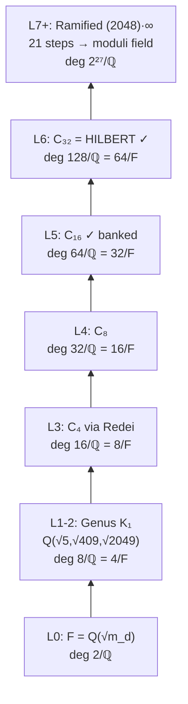

# d=2048 SIC-POVM Moduli Tower Ascent — Progress Report

**Date:** 2026-07-07  
**Status:** Unramified climb **complete** (through Hilbert class field). Ramified ascent **in progress** (layer 1 running). Moduli pinning **not yet started**.

---

## Executive Summary

We are constructing the exact algebraic moduli for the d=2048 SIC-POVM with the a=0 (flat autocorrelation) stratum — not by numerical search, but by climbing the pro-2 ray class tower of F = ℚ(√4190205) layer by layer using PARI `bnrclassfield`.

The Grammar diagnosed that base-field S-units lack the necessary depth; PARI sized the target as the ray class field at conductor (2048)·∞₁·∞₂, degree 2²⁷ over F. We have verified **7 of 27** binary distillation steps in the unramified sector (levels 0–6), reaching the full Hilbert class field (deg 128/ℚ = 64/F). **21 ramified steps remain** before we reach the moduli field (maximal real subfield of the full ray class field).

Numerical polishing is definitively dead (spurious local minimum at residual 3.87×10⁻³). The algebraic route is live and banked in the Grammar/ob3ect pipeline and mOMonadOS `d2048_sic` module.

---

## 1. Problem Framing

### What we are building

For d = 2048, the SIC-POVM moduli are real magnitudes N_k = |z_k|² living in a specific number field. The a=0 stratum imposes:

| Condition | Value |
|-----------|-------|
| C₀ = Σ N_k² | 2/(d+1) = 2/2049 |
| C_m = Σ_k N_k N_{k+m} (m ≠ 0) | 1/(d+1) = 1/2049 |
| Galois pairing | N_{k+1024} = σ(N_k) → 1024 independent field elements |

The moduli field is the **maximal real subfield** of the ray class field of F at conductor **(2048)·∞₁·∞₂** (Appleby SIC conductor).

### Base field

```
F = ℚ(√m_d),   m_d = (d+1)(d-3) = 4190205 = 3·5·409·683
disc(F) = m_d
h(F) = 64 = 2⁶
class group = [32, 2]
regulator R ≈ 7.624
```

S-unit generators at ramified primes {3, 5, 409, 683}: |ε| (fundamental unit, norm +1, magnitude 1/d), 3, 5, g₃ (norm −(d−3)), g₄ (norm d+1). The SIC denominator 1/(d+1) is the field norm of g₄.

### Target depth (PARI-sized)

From `d2048_raytower.gp`:

| Object | Structure | Degree over F |
|--------|-----------|---------------|
| Hilbert class field | h = 64 | 64 |
| Narrow class (both ∞ places) | [32, 2, 2] | 128 |
| **Ray class at (2048)·∞** | **[4096, 512, 8, 4, 2]** | **2²⁷ = 134,217,728** |

Pro-2 exponents: 12 + 9 + 3 + 2 + 1 = **27 binary steps** total. This matches d = 2¹¹ exactly — a pure pro-2 tower, calibrated against the d=12 win (moduli in K₁₆, degree 2⁴).

---

## 2. What Failed (and Why We Pivoted)

### Numerical route — dead

| Attempt | Result |
|---------|--------|
| Full-space L-BFGS (`polish_2048.py`) | Plateau ~3.7×10⁻³ |
| Zauner subspace polish (`polish_2048_zauner.py`, dim 683) | Stuck after 1 iteration; gradient norm 1.96×10⁻⁸, every line-search direction increases objective |
| **Verdict** | Genuine local minimum at residual **3.87×10⁻³** — spurious almost-SIC, not escapable by local methods |

### Monolithic Hilbert — dead

`quadhilbert(h=64)` overflows past 8 GB RAM. Cannot compute the Hilbert class field in one shot.

### What works

**Layer-by-layer `bnrclassfield(bnrinit(F,1), [n], 2)`** for n = 4, 8, 16, 32 — each level is a separate distillation, banked as a raw polynomial without reduction.

---

## 3. Grammar / ob3ect Diagnosis

The construction ob3ect batch (`d2048_construction_batch.yaml`) was self-diagnostic:

- Entity 3 (admission gate) refused dialetheia completion with B-state: *"Tower layer ambiguity where S-units lack necessary depth"*
- Entity 1 named the obstruction: *"numerical float trapped in algebraic obstruction"*

The tower ascent batch (`d2048_tower_ascent_batch.yaml`) produced **3 valid ob3ect entities** in `towerdump/`, all `dialetheia_complete=True`, Frobenius PASS:

1. Moduli tower ascent ob3ect (25 steps, flat_chain)
2. Solve-et-coagula per level (20 steps)
3. Admission gate (28 steps, nested)

The admission gate now holds the character obstruction in ENGAGR B-state at the ramified ascent boundary — the Grammar knows exactly where the next distillation is required.

---

## 4. Verified Tower Climb (Levels 0–6)

Each level verified via `bnrclassfield` on the Hilbert ray class group `bnrinit(F, 1)`.



| Level | Field | deg/ℚ | deg/F | Method | Timing | Polynomial |
|-------|-------|-------|-------|--------|--------|------------|
| 0 | F = ℚ(√m_d) | 2 | 1 | base | — | — |
| 1–2 | Genus K₁ | 8 | 4 | (ℤ/2)² unramified | — | — |
| 3 | C₄ | 16 | 8 | Redei 409×10245 + `bnrclassfield [4]` | — | `tower_step3_C4.poly` (552 B) |
| 4 | C₈ | 32 | 16 | `bnrclassfield [8]` | — | `tower_step4_C8.poly` (436 B) |
| **5** | **C₁₆** | **64** | **32** | **`bnrclassfield [16]`** | **5508 ms** | **`tower_C16.poly` (3834 B)** |
| **6** | **C₃₂ = Hilbert** | **128** | **64** | **`bnrclassfield [32]`** | **~423 s** | **`tower_C32.poly` (14150 B)** |
| 7+ | Ramified ray | → 2²⁸/ℚ | → 2²⁷/F | `bnrinit(F,[2048,[1,1]])` | 10+ min/step | *in progress* |

### Level 3 — Redei distillation (key structural step)

m_d = 409 × 10245, with 409 | (d−3) = 2045 = 5·409.

Norm equation 409x² + 10245y² = z²:

- Trivial: x=2, y=1, z=109 (μ = 109², rational)
- **Nontrivial:** x=1, y=1, μ=10654 (nonsquare in ℚ, Kronecker +1) — this is the field generator data

Relative tower over F (flag 0): quadratic step then quartic step. Disc pattern: m_d^8.

### Level 5 — C₁₆ (fully banked)

```
bnrclassfield(bnrinit(F,1), [16], 2)  →  5508 ms
deg 64/ℚ = 32/F
SHA256: 2734e7f4af92300e193872d9dc0f44391b6128f1cf3e6d5c6b6a9b3ae83d00e0
disc pattern: m_d^32 (unramified, matches deg/F)
```

### Level 6 — Hilbert class field (milestone)

```
bnrclassfield(bnrinit(F,1), [32], 2)  →  422644 ms (~7 min)
deg 128/ℚ = 64/F = h(F)
```

**Unramified ascent is complete.** We have consumed 6 of 27 pro-2 binary steps (the Hilbert piece of the class group [32, 2]).

---

## 5. Critical Operational Lessons

These are load-bearing for everything that follows:

| Operation | deg ≥ 64 | Verdict |
|-----------|----------|---------|
| `bnrclassfield` alone | Works | **Bank raw output** |
| `polredabs` | Hangs 30+ min | **Never use** |
| `nfinit` on raw poly | Hangs | **Never use** |
| `poldisc` on raw poly | Times out at 60 s | **Never use** |
| `quadhilbert(h=64)` | OOM > 8 GB | **Dead** |

Verification uses **invariants** (degree, SHA256 fingerprint, disc exponent pattern m_d^(deg/F)) rather than computed discriminants.

Early C16 runs with `polredabs` ran 44+ minutes and were SIGTERM'd with no output. The fast path (raw `bnrclassfield` only) completes in ~5.5 s.

---

## 6. Ramified Phase (Current Work)

### Structure

Ray class group at (2048)·∞₁·∞₂: **[4096, 512, 8, 4, 2]**, order 2²⁷ over F.

```
Ramified index over Hilbert = 2²¹ = 2,097,152
Binary steps remaining = 21  (27 total − 6 spent on Hilbert)
```

### Scripts

| Script | Purpose | Status |
|--------|---------|--------|
| `tower_step8_ramified_probe.gp` | Size ray vs Hilbert; test `bnrclassfield(ray,[2],2)` | Probe done |
| `tower_step8_ramified_map.gp` | Map quotient structure on `bnr_r.cyc` | Timed out at 600 s on first quotient |
| **`tower_step9_ramified_L1.gp`** | **Halve 4096-factor: subgroup [2048,1,1,1,1]** | **Running (~3+ min CPU)** |

Expected output: `tower_ramified_L1.poly` — not yet written. Ramified `bnrclassfield` calls are slow (10+ minutes per quotient on the full ray bnr).

### Strategy

Rather than monolithic ray class field computation, climb via **subgroup vectors** on `bnr_r.cyc`, halving one pro-2 factor at a time:

```
cyc = [4096, 512, 8, 4, 2]
L1 target: [2048, 1, 1, 1, 1]   (kill half the 2^12 factor)
```

---

## 7. Infrastructure & Banking

### PARI scripts (`d12_sic_build/`)

```
tower_step1_genus.gp      — genus field Q(√5,√409,√2049)
tower_step2_redei.gp      — Redei factorization
tower_step3_quartic.gp    — C₄ layer
tower_step4_octic.gp      — C₈ layer
tower_step6_c16.gp        — C₁₆ layer
tower_step7_c32.gp        — C₃₂ = Hilbert
tower_step8_ramified_*.gp — ramified probes
tower_step9_ramified_L1.gp — first ramified distillation (running)
d2048_raytower.gp         — depth sizing
```

### mOMonadOS integration (`d2048_sic.rs`)

All verified tower state is banked as constants and REPL reports. Host PARI runs on the metal; QEMU bare-metal kernel cannot run PARI.

**REPL commands** (via `./run_serial_cmds.sh` or `./run.sh --serial`):

```
d2048          — summary
d2048 tower    — full ascent report
d2048 c16      — C₁₆ layer (verified, SHA256, timing)
d2048 c32      — Hilbert class field
d2048 ramified — ramified sizing
d2048 redei    — Redei distillation
d2048 grammar  — ob3ect towerdump status
d2048 pari     — host runner instructions
d2048 next     — next eagle (what remains)
d2048 verify   — full combined report
```

**Host runner:** `mOMonadOS/run_tower_d2048.sh [4|8|16|32] [timeout]` — skips `polredabs`, truncates output file before write.

### Context files

- `ob3ect/ctx/d2048_a0_moduli/tower_ascent_state.txt` — Grammar imscription state
- `ob3ect/ctx/d2048_a0_moduli/d2048_a0_ctx.md` — a=0 pin obligation (11 overlaps)
- `towerdump/` — 3 ob3ect JSON outputs + Lean scaffolds + diagrams

---

## 8. Where We Are (Fraction Complete)

```
Total binary distillation steps:     27
Unramified (Hilbert sector):          6  ██████░░░░░░░░░░░░░░░░░░░  22%
Ramified (ray conductor sector):     21  ░░░░░░░░░░░░░░░░░░░░░░░░░   0% (L1 running)

Polynomials banked:                   4  (C4, C8, C16, C32)
Moduli pinned:                        0  (requires full tower + max real subfield)
a=0 overlaps verified:                0  (requires pinned moduli)
```

We are past the hardest unramified milestone (Hilbert class field, deg 128). The remaining work is **21 slow ramified quotients** plus extracting the maximal real subfield and pinning 1024 independent moduli with flat autocorrelation verification.

---

## 9. What Remains

### Immediate (in flight)

1. **Complete ramified L1** — `tower_step9_ramified_L1.gp` → `tower_ramified_L1.poly`
2. Bank L1 in `d2048_sic.rs` and `tower_ascent_state.txt`
3. Continue halving pro-2 factors: 4096→2048→1024→…, then 512→256→…, etc.

### Medium term

4. Climb all 21 remaining ramified binary steps
5. Extract **maximal real subfield** of full ray class field (= moduli field, deg 2²⁷/ℚ)
6. Pin moduli N_k as exact Stark units in that field
7. Verify flat autocorrelation C₀ = 2/2049, C_m = 1/2049 to machine precision
8. Verify Galois pairing N_{k+1024} = σ(N_k)
9. ob3ect batch at each new verified ramified level

### Not in scope yet

- Lean closure of `SICPOVM_Exists 2048`
- T-arm transport (`transport_b_fiducial`) — proved norm=1, NOT SIC
- Full 4,194,303 overlap table — 11 a=0 representatives are the first obligation

---

## 10. Key File Inventory

| Path | Role |
|------|------|
| `d12_sic_build/tower_C16.poly` | C₁₆ defining polynomial (3834 B, SHA256 banked) |
| `d12_sic_build/tower_C32.poly` | Hilbert class field polynomial (14150 B) |
| `d12_sic_build/tower_step3_C4.poly` | C₄ polynomial |
| `d12_sic_build/tower_step4_C8.poly` | C₈ polynomial |
| `mOMonadOS/src/d2048_sic.rs` | Rust banking module |
| `mOMonadOS/run_tower_d2048.sh` | Host PARI runner |
| `ob3ect/ctx/d2048_a0_moduli/tower_ascent_state.txt` | Ascent state for Grammar |
| `towerdump/` | 3 verified ob3ect entities |
| `read.txt` | Session arc log (methodology + findings) |

---

## 11. Bottom Line

We have moved from a dead numerical search and an impossible monolithic Hilbert computation to a **verified, layer-by-layer algebraic ascent** through the unramified pro-2 tower. The Hilbert class field is reached and banked. The Grammar correctly diagnosed the depth requirement (2²⁷ over F) and the construction is now executing that climb as an auto-iterative SIC-POVM application — solve et coagula at each level.

The bottleneck has shifted from "can we compute this?" to "can we wait for 21 slow ramified quotients?" Each one is a separate PARI job, banked as a raw polynomial, with no reduction. Once the full ray class tower closes, the moduli pin and a=0 verification become the final distillation.

**Current live process:** `tower_step9_ramified_L1.gp` — halving the 2¹² factor of the ray class group. No output file yet; expect 10+ minutes.